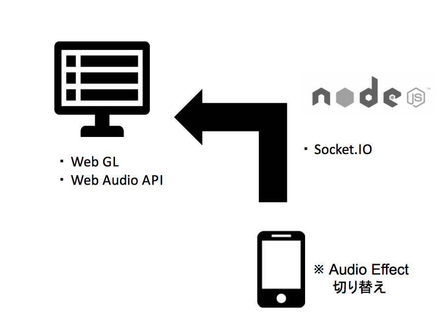

I decided to sound sound with this site. 
Since it is also boring to merely pass sound only, I would like to create my own effects.

Then, I decided to use sound effects using 'tuna.js'.

The following figures are pc and mobile communication pathway.  

