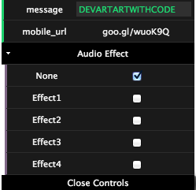

I programmed the sound effect function. 
Sound effect used audio api of html5 as it was in the above-mentioned. 
Moreover, as for this, the personal computer browser and the smart phone browser synchronize. 
This synchronization is realized by node.js. 

The value of 'mobile_url' is inputted into your smart phone.
And, youcan operate audio effevts from your smart phone
by WebSocket api.

